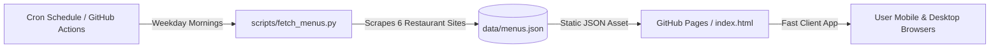

# 🍲 Otaniemi Lounas • Campus Lunch Feed

A modern, responsive, fast HTML web application designed to be hosted on **GitHub Pages** that fetches and displays the daily and weekly lunch menus of **6 popular lunch restaurants** in the Otaniemi / Innopoli campus area (Espoo, Finland).

🌐 **Live Demo / GitHub Pages Ready**: Zero external server dependencies required.

---

## 🍽️ Supported Campus Restaurants

| # | Restaurant | Location & Area | Lunch Hours | Official Website |
|---|---|---|---|---|
| 1 | **Ravintola Maukas** | Vuorimiehentie 5 (Otaniemi) | 10:30 – 14:00 | [mau-kas.fi/en/maukas](https://www.mau-kas.fi/en/maukas) |
| 2 | **Ravintola Nova Maukas** | Tietotie 3 (Otaniemi) | 10:30 – 14:00 | [mau-kas.fi/nova](https://www.mau-kas.fi/nova) |
| 3 | **Factory Maarinportti** | Maarintie 6 (Maarinportti) | 10:30 – 14:00 | [ravintolafactory.com/lounasravintolat/ravintolat/factory-maarinportti/](https://ravintolafactory.com/lounasravintolat/ravintolat/factory-maarinportti/#) |
| 4 | **Tastory Innopoli 2** | Tekniikantie 14 (Innopoli 2) | 10:30 – 13:30 | [compass-group.fi/.../innopoli2/](https://www.compass-group.fi/ravintolat-ja-ruokalistat/tastory/kaupungit/espoo/innopoli2/) |
| 5 | **Min Innopoli (Sodexo)** | Tekniikantie 12 (Innopoli 1) | 11:00 – 13:30 | [sodexo.fi/ravintolat/min-innopoli](https://www.sodexo.fi/ravintolat/min-innopoli) |
| 6 | **Prandia Din Maari** | Vaisalantie 4 (Innopoli 3) | 11:00 – 13:30 | [prandia.fi/prandia-din-maari-lounas-otaniemi-tapiola.html](https://prandia.fi/prandia-din-maari-lounas-otaniemi-tapiola.html) |

---

## ✨ Key Features

- 📅 **Day Selector**: Instant switching between **Today** (auto-detected), **Monday**, **Tuesday**, **Wednesday**, **Thursday**, **Friday**, and **Full Week**.
- 🔍 **Real-time Search**: Search across all dishes and restaurants (e.g. `lohi`, `keitto`, `burger`, `tofu`, `salaatti`) with search match highlighting.
- 🌱 **Dietary Filters**: One-tap filter chips for **Vegan** (VE), **Vegetarian**, **Gluten-free** (G), **Lactose-free** (L/VL), **Dairy-free** (M), and **Garlic-free**.
- 🟢 **Live Status Pill**: Dynamically calculates whether lunch is currently open, opening soon, or closed based on live Helsinki local time (EEST).
- ⭐ **Favorites & Pinning**: Pin your favorite restaurants to always display at the top of the feed (saved in `localStorage`).
- 📍 **Google Maps Integration**: Direct links on restaurant titles and addresses to open directions in Google Maps.
- 🌐 **Dual Language (FI / EN)**: Instant toggle between Finnish and English.
- 🌙 **Dark & Light Mode**: Smooth theme switching with automatic system preference detection.
- ⚡ **100% Client-Side + Automated GitHub Action**: Fully automated weekday updater that keeps `data/menus.json` fresh with 0 hosting costs.

---

## 🚀 How It Works (Architecture)



1. **Automated Fetcher (`scripts/fetch_menus.py`)**:
   - Runs on GitHub Actions every weekday morning (and can be triggered manually anytime).
   - Scrapes and parses the latest daily and weekly menus from all 6 restaurant sites.
   - Extracts dishes, prices, opening hours, coordinates, and dietary badges (`G`, `L`, `M`, `VE`, `VS`, `ILM`, etc.).
   - Normalizes data into `data/menus.json`.
2. **Frontend (`index.html`, `style.css`, `app.js`)**:
   - Zero framework overhead (Pure HTML5 + CSS3 + Vanilla ES6 JS).
   - Instant loading with offline caching support.
   - Fully accessible and responsive on mobile, tablet, and desktop screens.

---

## 📦 Setting Up on GitHub Pages

### 1. Push to your GitHub repository
```bash
git init
git add .
git commit -m "Initial commit: Otaniemi Campus Lunch Feed"
git branch -M main
git remote add origin https://github.com/<your-username>/<your-repo-name>.git
git push -u origin main
```

### 2. Enable GitHub Pages
1. In your GitHub repository, go to **Settings** > **Pages**.
2. Under **Build and deployment** > **Source**, choose **Deploy from a branch**.
3. Select branch **main** and folder **/(root)**, then click **Save**.
4. Your website will be live at: `https://<your-username>.github.io/<your-repo-name>/`!

### 3. Automated Daily Updates
The included GitHub Action (`.github/workflows/update_menus.yml`) will automatically:
- Run Monday through Friday at 07:00 and 10:30 Finnish time.
- Update `data/menus.json` and deploy changes automatically.

To ensure the Action has permission to commit updates:
1. In your repo, go to **Settings** > **Actions** > **General**.
2. Scroll to **Workflow permissions** and select **Read and write permissions**.
3. Click **Save**.

---

## 💻 Local Development & Testing

You can run and test the app locally with Python's built-in HTTP server:

```bash
# 1. Scrape latest menus
python3 scripts/fetch_menus.py

# 2. Start local web server
python3 -m http.server 8000

# 3. Open in your browser
# http://localhost:8000
```

---

## 🛠️ Project Structure

```text
├── index.html                           # Main web application HTML
├── style.css                            # Clean, responsive CSS styling & dark mode
├── app.js                               # Frontend interactive logic & i18n
├── data/
│   └── menus.json                       # Normalized restaurant menu JSON data
├── scripts/
│   └── fetch_menus.py                   # Python scraper for all 6 restaurants
├── .github/
│   └── workflows/
│       └── update_menus.yml             # Automated weekday GitHub Action
└── README.md                            # Documentation & deployment guide
```

---

## 📄 License
MIT License. Free to use, adapt, and share for Otaniemi campus students and staff.
